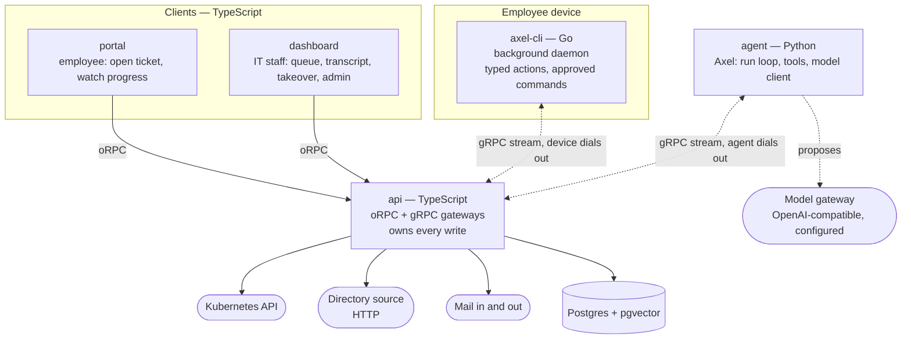

# Axiōma Architecture

**Document role:** System design — components, boundaries, and how they connect
**Related:** [idea.md](idea.md) for product intent · `axioma/README.md` for layout, commands and gates

## Shape

Six projects, each with the toolchain its job actually calls for. They are not a monorepo and share no package manager; the workspace directory holds them side by side the way a set of checked-out repositories would. (A seventh directory, `web/`, holds the public marketing site on :3003 — part of the workspace and the Tiltfile, not of the platform loop; nothing in this document applies to it.)

| Project | Language | Job |
|---|---|---|
| `api` | TypeScript | oRPC surface for the frontends, gRPC gateways for both agents. The only component that writes. |
| `portal` | TypeScript | Employee web app. |
| `dashboard` | TypeScript | IT web app. |
| `ui` | TypeScript | Governed UI primitives, mirrored verbatim into `portal` and `dashboard`. |
| `agent` | Python | Axel — the reasoning loop, tool registry, and model client. |
| `cli` | Go | axel-cli — one static binary on an employee laptop. |

The language boundaries are not incidental. Python is where the agent ecosystem lives — model clients, observability, and the computer-use tooling the pixel fallback would need if it shipped. Go produces a single binary with no runtime to install on a laptop, which is the constraint that dominates everything about that component. TypeScript holds the frontends and the API because the contract between them infers end to end there and nowhere else.

## Component Map

Both agents are gRPC **clients**. The API runs both servers. Neither can be dialled directly — one is a worker on whatever network it happens to run on, the other is behind NAT on a laptop that sleeps — so each dials out and holds a single bidirectional stream that work is pushed down.

## The Rule That Shapes Everything

**Axel has no database credentials, no cluster credentials, and no path to a device.**

Every side effect is a `ToolRequest` sent to the API, which executes it and returns the result. Axel decides; the API acts and persists.

Three things follow, and they are the reason for the arrangement:

- Persistence and authority live in one place, so there is no second ORM, no duplicated schema, and no question about which component wrote a row.
- A run is reproducible from its transcript, because tool name plus validated input is the whole record of what happened.
- Credentials never leave the API. Compromising the agent yields the ability to *ask* for things, not to do them.

## Invariants

Decisions the codebase currently honours, each verified against the tree. They are cheap to break by accident and expensive to restore, so they are recorded here rather than left in the plan documents that argued them.

**Behaviour never keys off a name.** Status is data: `ticket_statuses` carries `state_type`, `is_closed` and `pauses_sla`, and behaviour reads those flags, never the key. The same rule produces `merged_into_id` as a column rather than a merged status, and `snoozed_until` as a timestamp compared at query time rather than a snoozed status. The live status table contains neither `merged` nor `snoozed`, and it must stay that way — renaming a status is a configuration change, not a code change.

**Elapsed working time, never stored deadlines.** `ticket_stopwatches` accumulate `accumulated_ms` and `pending_ms` against a business-hours calendar with holidays. A deadline column cannot express a pause, and the pause is the point. There is no deadline column anywhere; do not add one.

**The portal's boundary is enforced by data shape, not client discipline.** `getMyTicket` filters visibility in SQL *and* its contract type omits the field; knowledge does the same for audience. A page that renders nothing sensitive while fetching it is still a leak. Never add a client-side filter as the mechanism.

**Deny by default is structural.** `os` and `authenticatedProcedure` are deliberately not exported from `server/orpc.ts`, so a procedure cannot be written without naming a capability, and a test asserts it. Do not export them for convenience.

**One vocabulary per concept.** Capability keys are shared between roles and API keys rather than a second permission model; one action union is shared by the rules engine and workflows. Two enums for one concept drift, and the drift is silent.

**Axel reads more than it writes.** It holds no credentials, asks the API for every side effect, does not author knowledge, and does not post into the human conversation. Its write paths beyond its own run records are the CMDB observation and the change record raised when it patches.

**Search projections are authorization-neutral; authorization is applied at query time.** `search_documents` is a denormalized projection with no permission baked in. That is deliberate, and it means every read path over it must filter — the projection is not the boundary.

**Email threads by reference, never by subject.** Matching is on retained ticket-reference tokens with a word boundary. Subject similarity is not threading.

**Multi-tenancy is not deferred — it is decided against.** The deployment model is one stack per customer, inside that customer's infrastructure. No `tenant_id` exists on any table and none should be added.

## Contracts

Three mirrors, each generated, none edited in place.

**oRPC, for the TypeScript half.** `api/src/contracts` declares procedures with zod schemas and imports nothing but `@orpc/contract` and `zod` — that constraint is what makes it safe to copy. `pnpm contracts:publish` mirrors it verbatim into `portal/src/sdk/contracts` and `dashboard/src/sdk/contracts`, stamped as generated. Handlers live in `api/src/server` and are bound with `implement(appContract)`, so a handler whose output stops matching the declared schema fails to typecheck in `api` rather than at runtime in a frontend that mirrored a contract the server no longer honours.

**Protocol buffers, for the language boundaries.** `api/proto/axioma.proto` is the source of truth, mirrored into `agent/` and `cli/` by the same command. It defines `AgentChannel` and `DeviceChannel` — same shape, remote side dials in.

**UI primitives.** `axioma/ui/src/components` holds governed primitives, mirrored into both frontends by `ui/scripts/publish-ui.mjs`. Same discipline as contracts: edit the source, run the publish, never touch a copy.

Contract-first is what allows separate repositories at all. A contract that dragged in a Hono context and an auth module could not cross into a frontend that has neither.

## Axel

A bounded loop: read, think, act, verify. The loop owns the sequence and the limits; the model owns only what to try next. No verdict is taken from model confidence.

**Knowledge retrieval is forced, not optional.** Before the model takes its first turn, the loop issues `knowledge_search` itself with the ticket title and body as the query. The API fuses lexical and vector ranks and falls back to lexical retrieval when embeddings are unavailable. Results are safe projections of published unrestricted articles, known errors, de-identified resolved-ticket and terminal-run outcomes, and documents linked to the current ticket; access is applied in SQL before ranking. `knowledge_fetch` reads a full authorized item under the same rule. Prior tickets and runs are precedent, not authority.

**Tools are typed and registered.** Axel picks a tool by name and supplies parameters validated against a pydantic schema before anything leaves the process. It does not compose commands, shell strings, or API calls. Adding a capability means adding a tool, which is a code change and a review.

| Tool | Effect | Verified by |
|---|---|---|
| `ticket_read_messages` | read | — |
| `knowledge_search` | read | — |
| `knowledge_fetch` | read | — |
| `cluster_read_pods` | read | — |
| `cluster_read_deployment` | read | — |
| `cluster_patch_image` | write | `cluster_read_deployment` |
| `device_read_state` | read | — |
| `device_run_action` | write | `device_read_state` |
| `device_computer_use` | write — pixel fallback, not implemented | `device_read_state` |
| `device_propose_command` | write — writes a proposal, reaches no device | — |
| `cmdb_record_observation` | write | — |
| `cmdb_impact` | read | — |

`device_computer_use` is the pixel fallback and only that. The GUI tier is not a separate tool: the five `gui_*` steps are `device_run_action` actions like any other, verified by the `screen` facet. `device_propose_command` names a command but does not run one: it writes a row for a person to decide on. No registered tool executes a caller-supplied command at all, and a test asserts that absence rather than assuming it.

Every write that changes external state names the read that confirms it. A write returning success means the call was accepted, not that the problem is fixed — so after acting, Axel re-reads through the named read tool, and a run cannot resolve while a verification obligation is outstanding. `cmdb_record_observation` is one of two deliberate exceptions: a CMDB observation has no external state to re-read — the write *is* the record, additive rather than corrective — so its `verified_by` is empty by design, not by omission. `device_propose_command` is the other: it changes nothing on the device, so there is nothing for a read to confirm. A run must successfully record at least one CMDB observation before it can resolve; failed typed outputs do not count.

**The loop is bounded.** Ceilings on tool calls, model turns, wall time, and consecutive failures. Hitting any of them ends the run as `exhausted` and escalates, rather than leaving a ticket in a partial state. A resolution attempted with verification outstanding or without a successful CMDB observation is rejected twice before the run escalates.

**Unknown tools and invalid input are observations, not crashes.** They go back into the transcript so the model can correct itself inside the same budget.

**Terminal states carry a resolution code.** `fixed`, `workaround`, `not_reproducible`, `duplicate`, `no_action_required`, `rejected` — shared with the API and asserted by a parity test.

**The model is not fixed.** The adapter is LiteLLM against an OpenAI-compatible endpoint, configured with an endpoint, model, and credentials. The run record stores which model actually answered rather than which one was configured.

## axel-cli

One Go binary, two modes.

**`axel-cli daemon`** is headless and runs as a logon Scheduled Task. There is no terminal attached, so there is no terminal UI. It holds the outbound connection, executes typed actions, and reports results.

**`axel-cli status | enroll | doctor`** are operator-facing, run by IT staff on a machine they are debugging. These carry the terminal UI — [Bubble Tea v2](https://charm.land/bubbletea) (`charm.land/bubbletea/v2`) with Lip Gloss — because that is where a person is actually looking.

Design points that matter:

- **Outbound only.** The device dials the gateway; the gateway never dials in. That is what works through NAT, on home networks, and behind corporate proxies without a firewall change.
- **Identity** is a UUID minted on first run and persisted under the user profile. It survives restarts, upgrades, and network roaming, and dies with the profile — the right lifetime for "this person's laptop". A hardware ID would outlive a reimage, clone with a VM image, and be a privacy artifact besides.
- **Liveness.** A sleeping laptop does not close its TCP connection, it stops answering. Only an application-level ping notices. The client pings on an interval and reconnects with exponential backoff plus jitter, so a fleet waking together does not stampede.
- **Replay.** On reconnect the device reports the last sequence it processed and the gateway replays past it. Deliberately a bounded in-memory outbox, not durable queuing.
- **A logon Scheduled Task, not a Windows service.** A service runs as LocalSystem in session 0, which cannot reach the user profile, mapped drives, or per-user applications — where most real laptop problems live. It also installs without administrator rights. UI Automation needs the interactive desktop session for the same reason, so the tier-two GUI path exists only because of this choice — a session-0 service could not have driven it.

**Actions are named, never composed — except for human-approved proposals.** The gateway sends an action name and typed parameters; the argument list for each action is written out in the binary. Facet reads work the same way. No command string or argument vector crosses on the model's authority alone: the Stage C exception is a human-approved, digest-bound proposal whose stored vector the API dispatches directly with no shell, so shell metacharacters remain ordinary arguments rather than syntax. No unapproved vector crosses it either — the model cannot select that action at all, for the reasons below. That is what stops a ticket talking the agent into running something arbitrary. The binary implements eighteen actions today — twelve tier-one actions, the five GUI steps below, and the approved-command action the model may not select — each paired with a diagnostic facet that observes its effect, so the verifying read always has something to look at — an action nothing can observe cannot discharge the obligation and is not added. `restart_user_process` accepts only allowlisted process names, and that allowlist now carries the eight applications employees actually report as stuck rather than the single placeholder it started as. The API schema, the agent's tool definitions, the proto enums, and the binary name the same seventeen selectable actions and the same eleven facets, and a parity test asserts that agreement in both directions — and asserts the eighteenth's absence from the model-facing enum rather than excusing it.

Tier two ships, and it is not cua. GUI remediation runs on **Windows UI Automation**, driven from PowerShell exactly like every other facet and action — non-admin, no new dependency, no Python, no vision model, and nothing installed over the network. The `screen` facet returns one window's accessibility tree reduced to the controls something can act on: name, role, whether it is enabled, and which UI Automation patterns each supports. Text, not pixels. It takes an optional `window` parameter, a title substring; omitted, it reads the foreground window. Five actions — `gui_invoke_control`, `gui_set_control_value`, `gui_toggle_control`, `gui_select_item` and `gui_expand_control` — each drive exactly one pattern (Invoke, Value, Toggle, SelectionItem, ExpandCollapse) on a control `screen` has already reported, and `screen` is also the facet that verifies them.

That is what stops tier two being an exception to the boundary above. The facet **enumerates** the controls that exist; a step **selects one by name** out of that enumeration. Caller input picks a key from a set the device produced — the same shape as the `restart_user_process` allowlist, generalised to the GUI. There are no coordinates, so no pixel drift and no resolution dependence, and there is no free-text keyboard step, so nothing can type into whatever happens to have focus. Caller values reach the script through the environment rather than the command line: control and window names are full of spaces, and a value bound through `powershell.exe -Command "& { param($x) ... }"` is silently re-split on them, where an environment value cannot be parsed as code. That was found by testing rather than by reading.

Measured rather than asserted, as the facet actually runs — a cold PowerShell process, capped at thirty controls: one browser window takes 3.6 seconds and 2.9KB of JSON, against thousands of vision tokens and a set of coordinates for the same look in pixels. A UI Automation cached request is what makes that viable; the uncached form of the same script measured twenty-one seconds, because every property read is a separate call into the target process. A live test drives a real Notepad through the Go dispatch path — read the screen facet, set a control value, read again and confirm the facet saw it — behind the `AXIOMA_LIVE_GUI_TEST` environment variable, because it drives a real window.

**General execution exists, and a person is the gate.** `run_command` is the eighteenth action and the only one carrying an argument vector the model chose. Axel cannot dispatch it. `device_propose_command` writes a row to `device_command_proposals` and returns, and the run then escalates with its diagnosis rather than waiting — a run holds a 45-second lease and a person decides in hours, so there is no paused run state and no resume protocol, and none was needed. A holder of the new `device.approve` capability reads the exact argument vector untruncated on its own dashboard screen and approves or rejects. Approval dispatches the command **outside any run**, from the stored row, through a `device_run_command` branch in the gateway that `executeTool` cannot reach.

Each control is a refusal, and each has a test. A digest binds the approval to one exact vector, so a command edited afterwards no longer matches the decision it would ride. Dispatch consumes the approval through a `status = 'approved'` predicate, so an approval authorises exactly one execution and a concurrent dispatch loses rather than double-running. An undecided proposal expires. `devices.execution_enabled` is false unless an operator turns it on, and the device refuses independently — `run_command` requires both a proposal reference and a local opt-in marker file on that machine, so one compromised gateway is not enough. `device.approve` is granted to `platform-engineer` and deliberately not to `it-analyst`: `device.command`, meaning *may issue a typed action*, is held by every analyst, so reusing `approval.decide` would have let one person propose and authorise. And `device_commands.proposal_id` finally makes *who authorised this* answerable — that table had no actor column at all.

It is a table of its own rather than a row in `approvals` because reusing that one would have collided with its one-open-approval-per-ticket index, let a device approval launder a previously rejected catalogue approval through the latest-row-wins guards, and left a ticket permanently unrunnable and unclosable after a rejection, since nothing in the codebase reopens an approval row. The coverage is unit-level: there is no end-to-end test through a live gateway and a real device. Expiry is swept on read rather than by a timer, so a proposal goes stale the next time somebody looks.

cua is now the fallback rather than the mechanism, and it remains **not implemented**. `execute` in the daemon refuses every computer-use command unconditionally, and `internal/cua` contains a detector that probes `cua-computer-server` on a loopback port, whose only caller is the `doctor` checklist. What it is for is the surfaces UI Automation cannot see — canvas applications, remote desktop, Citrix, some Electron. `cli/docs/cua-spike.md` records what blocks it, and that finding has not moved: `cua-computer-server` exposes no objective-submission endpoint and no server-side reasoning loop, so the contract the design assumed, submit an objective and receive a step transcript, does not exist to call. Putting that reasoning in axel-cli would break the rule that the CLI holds none, and forwarding a free-form objective as a shell or input command would break the typed-action boundary above. That gate stands over the pixel path alone; it no longer stands over GUI remediation.

Device channel authentication is in place: the gateway requires TLS material and will not start without it, verifies a per-device credential on hello, and refuses a revoked device, and the daemon dials with real transport credentials. That precondition is met rather than standing.

The choice of driver stands for the fallback: [cua](https://github.com/trycua/cua) runs locally as `python -m computer_server` with a `[driver]` extra, and axel-cli would drive it over that local API. cua is the choice because its driver runs in the background — agents click, type, and verify *without stealing the cursor or focus* — which is the property that makes this acceptable on a laptop somebody is working on. Agent-S was rejected for using PyAutoGUI, which takes the real mouse and keyboard, and for requiring a separately hosted grounding model. That the accessible path needs no driver at all does not reverse that: UI Automation has the same background property natively, because it is the API screen readers use.

cua is Python and axel-cli is Go, so that language boundary would be a process boundary. Axel itself has no cua dependency, because Axel has no device path at all — it asks the API, the API dispatches to axel-cli, and axel-cli decides which tier can serve the request. A device without cua installed **refuses** rather than falling back: a missing fallback means escalate, not improvise. Today that refusal is universal — a device with cua installed refuses on the same path — so the property is designed but not yet discriminating. It catches far fewer requests than it did, because the accessible GUI no longer goes through it.

**An action nothing can observe is not added.** `refresh_user_policy` was designed, built, and then dropped, because no non-admin, edition-portable, language-neutral read observes a user Group Policy refresh: `gpresult /x` does not exist on Home editions — verified by running it, which reports `Invalid argument/option - '/x'` — and the `Group Policy\State\<SID>\Extension-List` timestamps are absent on non-domain machines. Every write names the read that confirms it, so an unobservable action cannot discharge its own verification obligation. Revisit it against a domain-joined machine; the action itself is one line, and the facet is the missing half.

**Facet scripts are measured on real hardware, not fixtures.** Two of them were rewritten after being run on an actual laptop rather than unit-tested. `Get-Printer` piped into `Get-PrintJob` per printer measured 50 seconds on a six-printer machine, and eight separate `Get-Process -Name` lookups measured 25 seconds — both against what was then a fixed 30-second budget. Rewritten against CIM and a single process query they measure 3 seconds and under 1. Walking a user temp directory still takes 28 seconds with 36,000 files in it, which is inherent rather than fixable.

**Timeouts are per action and per facet.** Every device command originally took a hardcoded 30 seconds from the gateway regardless of what it was, which the original five fast network actions never noticed and the slower diagnostic facets immediately did. A read batch takes the longest allowance it asked for, and everything stays inside the device's own `maxCommandTimeout` of 300 seconds.

## Kubernetes

The first connector, and it lives in the API because the API owns every side effect.

**Reads** come from pod status rather than events wherever the signal exists there: status is structured, events are prose. `containerStatuses[].state.waiting.reason` gives `ImagePullBackOff` and `CrashLoopBackOff` directly, `lastState.terminated.reason` gives `OOMKilled`, and `conditions[PodScheduled].reason` gives `Unschedulable` with the scheduler's own message.

**Writes use JSON Patch with an explicit path**, not strategic merge. A JSON Patch with `op: replace` fails loudly if the object is not the shape the caller believed; strategic merge applies silently and the mistake surfaces later. Every write runs once with `dryRun` before running for real.

**Writes are change-gated.** A patch is wrapped in an automatically created standard change record — implementation plan, test plan, rollback plan naming the previous image, `cabRequired: false` because a standard change is pre-approved, and a five-minute post-change verification deadline. The verifying read completes the change; an expired deadline sweeps it to `failed` with a post-implementation review recording why.

**The write surface is one field.** `assertStandardImageChange` permits only a tag or digest change on the *same* image name. Scaling, rollback to a prior revision, environment variables, probes, and configuration are all outside what Axel can change.

**Rollout status** is polled, not watched — fewer moving parts, and the caller gets a progress stream for free.

**Many clusters, one per environment.** `environments` rows carry a connection — an in-cluster ServiceAccount or an encrypted kubeconfig — and clients are cached per environment rather than built once at process start. `KUBECONFIG` and `AXIOMA_K8S_CONTEXT` remain the bootstrap for a single default environment, so an installation that never registers one still works.

**Which environment a run targets is resolved server-side.** The order is ticket, then CMDB, then the configured default, and the agent may only name an environment already linked to that ticket's service. Ticket text is chosen by whoever files the ticket and reaches the model verbatim, so letting it steer the target would put production one sentence away in any ticket. An environment in `shadow` mode refuses every write-effect tool while still recording the attempt in the transcript.

## ITSM Connector

The second connector, and the one that lets Axiōma run *behind* a customer's existing service desk rather than replacing it. Their portal stays the front door; tickets sync inbound, results post back as work notes.

**Authentication is OAuth 2.0 client credentials, not a static bearer.** `itsm_connectors` stores `clientId` and `clientSecretEncrypted` rather than a generic credential, and the transport layer keeps an access-token cache. That is genuinely new work in this tree: directory sync and mail both use a static bearer, and nothing else here refreshes a credential.

**Foreign tickets are keyed by the `(source, external id)` pair.** ServiceNow's own `correlation_id` and `correlation_display` convention is the same shape, arrived at independently; write-back populates their side of the link, which also gives echo suppression a third signal.

**Duplicate suppression is three mechanisms, because no one of them is sufficient.** Trigger on *transitions* rather than states — `State changes to Resolved` rather than `State = Resolved`, since the latter fires on every subsequent save. Write a persistent, checkable marker and exclude on it, which is Zendesk's tag pattern with a domain-specific key. And keep a hard ceiling, because an iteration limit bounds a *run* and nothing otherwise bounds the *number* of runs — `agent/axel/loop.py` is bounded, the count of dispatches was not.

**Migration tooling moves open work and leaves history behind.** Retention obligations that keep an old system alive — HIPAA six years, SOX seven, PCI DSS twelve months — name no service-desk ticket class among them, so wholesale ticket migration buys little and costs a great deal. Co-existence with a phased cutover is the honest shape; "one-click migration" is not a supportable claim.

**Shadow-mode agreement is measured three ways at once, never pooled.** Axel's action distribution is imbalanced by design, so raw percentage agreement flatters a system that always says the common thing, while Cohen's kappa fails in the other direction under the kappa paradox — reporting poor reliability precisely when the distribution is skewed. Raw agreement, kappa, and Gwet's AC1 are reported together and stratified by action class.

## Data Model

143 tables across 44 schema modules, Better Auth's own included. Grouped by what they carry:

| Area | Carries |
|---|---|
| Tickets | `tickets`, transitions, creation claims, messages, origins, audit, time entries |
| Vocabulary | `ticket_statuses` and their permitted transitions — the flags behaviour reads |
| Agent | `agent_runs`, `agent_steps`, `agent_tool_calls` |
| Devices | `devices`, `device_commands` |
| CMDB | classes, class properties, objects, object properties, relationship types, object relationships, and ticket links |
| Knowledge | folders, articles, versions, tags, article tags, an access-control list, and gap clusters linking unanswered tickets |
| Problems | problem records and known errors with root cause and workaround |
| Changes | `changes`, CAB members, CAB votes, ticket links, transitions |
| Catalogue | service families, services, subcategories |
| Approvals | catalogue and change approvals |
| SLA | `slas`, `olas`, `ticket_stopwatches`, notification rules, escalation events |
| Calendars | calendars, working hours, holidays |
| Mail | mailboxes, inbound emails, attachments, activity log, ticket mail origins, send log |
| Channels | ticket origins, messaging channels, threads, channel messages |
| Automation | ticket rules and firings, workflows, workflow executions, webhook deliveries |
| RBAC | roles, role capabilities, user roles, team roles, role grants |
| Org | departments, teams, and their membership |
| Assets | assets, inventory, software licences, suppliers, scheduling |
| Presentation | dynamic fields, forms, templates, views, dashboards, notifications |
| Search | `search_documents` projection and reconciliation state |
| Platform | API keys, rate limits, numbering, links, journal, presence, pending work, identity providers, status page |

`agent_steps` is what makes the dashboard useful and a bad run debuggable. Rows are written as the run proceeds, not at the end, so a run that hangs still shows how far it got.

`agent_tool_calls` is the duplicate-suppression record: a tool request is inserted keyed by run and call id, and a repeat of the same call returns the stored result rather than executing again.

## CMDB

Two jobs, worth separating.

**As context, it is read.** Before diagnosing, Axel is given what the platform already believes about the affected service and device — newest observation per class and external id — labelled in the prompt as prior belief rather than established fact. `cmdb_impact` walks relationships breadth-first with a bounded depth.

**As a record, it is written.** Observations are additive: `cmdb_record_observation` always inserts a new object with its properties and relationships, validated against the class's declared properties. Accuracy is a read-time property, produced by taking the newest observation per identity, not by overwriting.

Every row records **where the fact came from**: which ticket, which run, which step, and when. That provenance is a few columns and it is the only part of a governed CMDB that is genuinely expensive to add later. Proposal workflows, separate ownership, approval before correction, and rollback can all be built on top of it whenever they are wanted.

The store starts with nine seeded classes and **zero objects**. It fills from observation, so the first ticket about a service has no prior belief about that service.

## Stack

| Layer | Choice |
|---|---|
| Frontends | TanStack Router + React 19, Tailwind 4, Vite |
| Shared UI | `axioma/ui`, mirrored into both frontends |
| API | Hono, oRPC, Better Auth |
| Database | PostgreSQL with pgvector via Docker Compose, Drizzle |
| Agent | Python 3.14, uv, pydantic, LiteLLM against an OpenAI-compatible endpoint |
| Device agent | Go 1.25, one static binary; Bubble Tea v2 for operator commands |
| Wire | gRPC for both agent boundaries |
| Lint and format | Biome (TypeScript), ruff (Python), gofmt (Go) |

The frontends are SPAs rather than a server-rendered framework. The API is a separate service, so there is no benefit in a framework that wants to colocate route handlers with pages.

pgvector is used. `search_documents` carries a `vector(1536)` embedding behind an HNSW cosine index alongside a weighted full-text index, and retrieval fuses the two rank lists by reciprocal rank. Embeddings are written only when an embedding key is configured; without one the vector leg is skipped, retrieval reports `mode: "lexical"`, and the run proceeds. Degrading rather than failing is deliberate. Degrading *silently* is not, and it is unfixed.

## Deployment

Four images, a Helm chart, and the customer's own cluster. The Tiltfile is the development path and is not a deployment description.

**Migrations run as a plain Job, one per release revision, not a Helm hook.** A `pre-install` hook runs before the release's own resources exist, so it deadlocks against the bundled Postgres on a clean install; a `post-install` hook runs after `--wait` has already given up on pods waiting for the schema. Instead every API pod runs an init container that blocks until the row count in `drizzle.__drizzle_migrations` reaches the number of journal entries baked into its own image. The Job stays the only writer, so "exactly once" holds at any replica count, and no replica serves traffic against a schema older than its own code.

**The model gateway is configurable and defaults to outbound.** Pointing `agent.model.apiBase` at an OpenAI-compatible endpoint the customer operates is the only change needed to keep inference inside their perimeter, and the chart deploys no inference server of its own. That default has a consequence the chart states in three places rather than hiding: while it points at our host, ticket contents leave the customer's network to reach it. Co-deploying inference was rejected as a larger piece of work than the phase held — it means choosing a model server and owning its hardware requirements — not as a permanent answer.

**Each build context is exactly one project directory.** The four Dockerfiles live with the projects they build rather than at the workspace root, because each project is standalone with its own lockfile and toolchain, and a build context reaching outside its own directory would contradict that.

**Both database shapes are supported, and the one that cannot work fails the render.** `postgresql.enabled` deploys a `pgvector/pgvector:pg18` StatefulSet for evaluation; disabling it and supplying a DSN points at a customer database, whose pgvector requirement is documented. Bundled Postgres with its password in an `existingSecret` is refused at template time with that explanation, because the chart cannot read the password and therefore cannot compose a DSN — a broken release later is worse than a failed render now.

## What This Architecture Does Not Do

Stated because the gaps are deliberate or known, and someone reading the component map will look for them.

- **Human access is capability-gated.** oRPC procedures deny by default and resolve direct and team role capabilities once per request; reporter-owned ticket views retain their narrower response shapes as defence in depth.
- **Nothing constrains blast radius.** A cluster write can patch any deployment the service account reaches, within the one field it is allowed to change; a device action runs with the logged-in user's rights, over a surface that now includes deleting cached application data under that user's profile and driving any control the accessibility tree exposes in that user's own windows. General execution widens that surface furthest, and what bounds it is a person rather than the system: an approved command runs as any program that user could have started, and only the approver's judgement decides what it may touch.
- **One agent action is approved before it runs; the rest are not.** A proposed device command reaches a device only after a `device.approve` holder authorises that exact argument vector. Everything else — typed actions, GUI steps, cluster patches — runs on the tool boundary alone. The approval machinery that exists otherwise is for humans, CAB voting on changes and manager decisions on catalogue requests, and Axel's own patches are raised as pre-approved standard changes rather than routed through it.
- **Duplicate suppression exists; durability does not.** A repeated tool call within a run returns its recorded result, and a device rejects a sequence it has already accepted — but that rejection reports the outcome as indeterminate rather than replaying it, and in-flight device commands are lost if the API restarts. Widening the action set widens the consequence of both.
- **The device channel is authenticated but the binary is unsigned.** The gateway requires TLS, verifies a hashed per-device bearer credential before registration or replay, supports single-use enrolment, rotation, and revocation, and lets clients add a customer CA without disabling verification. Authenticode signing remains deferred pending certificate procurement.
- **The deployment artifact is not published.** Four Dockerfiles and a Helm chart exist under each project and `axioma/deploy/`, and images are built locally and loaded into a cluster. There is no image registry, no CI pipeline that produces them, and no high availability, autoscaling, backup or disaster recovery in the chart. The Tiltfile is still the development path and `api/k8s/` still holds demo workloads to break, not the platform.
- **The pixel fallback is not implemented.** GUI remediation ships through UI Automation, but a surface with no accessibility tree — canvas applications, remote desktop, Citrix, some Electron — has no path at all. The request path for it exists and the daemon refuses it, on every device rather than only where cua is absent. The gate that does not lift with the channel above is the spike finding that `cua-computer-server` offers no objective-submission endpoint to send an objective to.

The first three are scope decisions. The rest are distance between the design and the tree.
