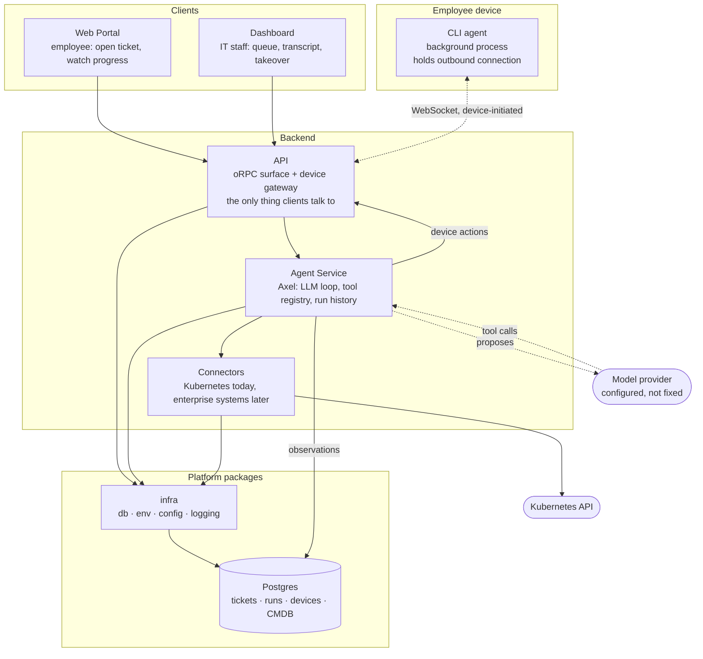
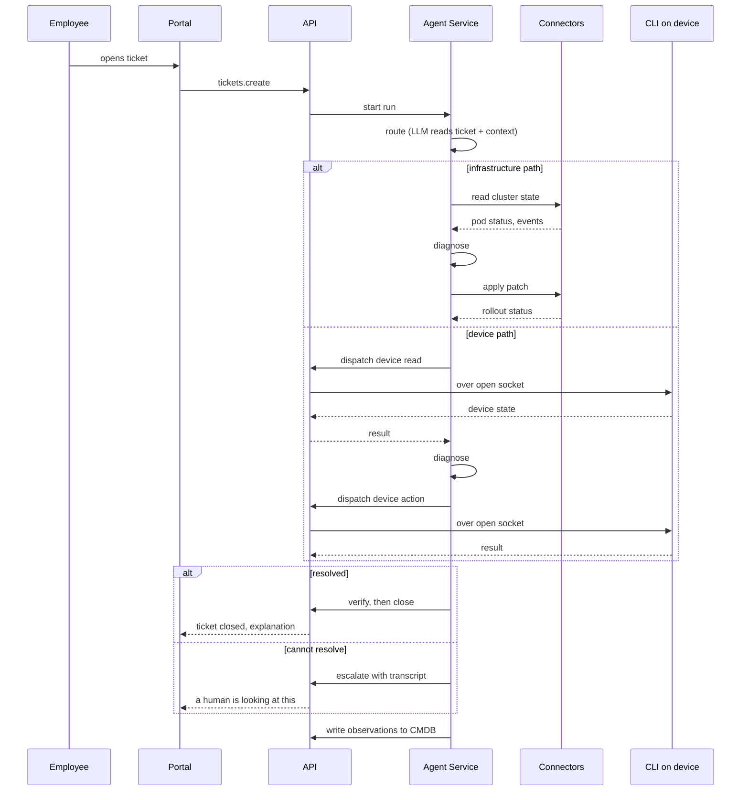

# Axiōma Architecture

**Document role:** System design — components, boundaries, and how they connect
**Related:** [idea.md](idea.md) for product intent, [implementation.md](implementation.md) for repo layout and build order

## Component Map

## Components

### Employee-facing

**Web Portal.** Where employees log in, open tickets, and follow them. Shows progress in plain language — what Axel is looking at, what it found, what it changed. Never shows raw tool output or model reasoning.

**Dashboard.** Where IT staff work. The ticket queue, the full agent transcript for any ticket, the evidence Axel gathered, and controls to take over, close, or reassign. Everything the portal hides is visible here.

Both are separate apps rather than one app with two roles. They share components and the API client, but their audiences and screens diverge immediately, and merging them would mean a permission system the MVP does not have.

### CLI

A small process installed on the employee's Windows laptop. It runs in the background, holds a connection to the API, reports device state on request, and executes actions it is told to execute.

The connection is **device-initiated over WebSocket**. The device dials out; the backend never dials in. That is what makes it work through NAT, on home networks, and behind corporate proxies without any firewall change.

Design points that matter:

- **Identity.** On first run the CLI generates a UUID and persists it to `%LOCALAPPDATA%\axioma\device.json`. That is the device ID for the life of the profile. The hello message carries hostname, username, platform, and release so the dashboard reads as something human.
- **Liveness.** A laptop that sleeps does not close its TCP connection, it just stops answering. So the server pings every 30 seconds and terminates peers that miss a round; the client sends its own application-level ping every 25 seconds and reconnects on exponential backoff with jitter, capped at 30 seconds.
- **Replay.** On reconnect the client sends the last sequence number it saw, and the server replays unacked commands from a bounded in-memory outbox. Sleeping laptops make this necessary. It is deliberately not durable queuing — a hundred commands, ten-minute TTL, gone on restart.
- **Install.** A logon Scheduled Task running as the interactive user, not a Windows service. A service runs as LocalSystem in session 0, which cannot reach the user profile, mapped drives, or per-user applications — which is where most real laptop problems live. It also installs without administrator rights.

### Backend

**API.** The only surface clients talk to. It owns the oRPC procedures the portal and dashboard call, and it owns the WebSocket gateway the CLI connects to. Everything crossing a process boundary goes through here.

The device gateway lives in the API rather than in its own service for one reason: the connection is stateful and long-lived, and the thing that dispatches to a device needs to be the thing holding the socket. Splitting them means a second hop and a device-to-socket routing table for no gain at this size.

**Agent Service.** All AI logic. Owns the agent loop, the tool registry, run history, and the routing decision. Given a ticket it plans reads, calls tools, forms a diagnosis, and either acts or escalates.

**Connectors.** The platform's hands. The only component that talks to enterprise systems — Kubernetes today, more later. The Agent Service decides what should happen; Connectors makes it happen. Keeping them separate means the agent's tool registry is a list of capabilities rather than a pile of API clients, and adding a system is a connector plus a tool definition.

**infra.** Platform plumbing: database access, environment and config loading, logging. Shared by everything, owns nothing domain-specific.

**Shared types.** The oRPC contract package. Procedure definitions and their input and output schemas live in one place and are imported by the API, both frontends, and the CLI. Type safety across the boundary comes from sharing the definition, not from generating and syncing clients.

## How A Ticket Moves

## Agent Design

Axel runs a bounded loop: read, think, act, verify.

**Tools are typed and registered.** The agent picks a tool by name and supplies parameters that are schema-validated before anything executes. It does not compose commands, shell strings, or arbitrary API calls. Adding a capability means adding a tool, which is a code change.

This is not a safety control — the MVP has none — it is how the system stays debuggable. When a run goes wrong you want to see which tool was called with what, not reverse-engineer a generated command.

**Tool categories:**

| Category | Examples | Side effects |
|---|---|---|
| Cluster read | pod status, deployment status, events, logs | None |
| Cluster write | patch deployment image, patch resource limits | Yes |
| Device read | resolver config, adapter state, service status, reachability | None |
| Device action | flush DNS cache, reset resolver, restart a named service | Yes |
| CMDB | read service dependencies, write observation | Writes are additive |

**The loop is bounded.** A run has a maximum number of tool calls and a maximum number of model turns. Hitting either ends the run in escalation rather than in a partial state. Without this a confused agent loops forever and the ticket never resolves or escalates.

**Verification is a separate read.** After acting, the agent re-reads state through a read tool to confirm the change landed. A write tool returning success means the API accepted the call, not that the problem is gone. For the pod scenario that means polling deployment status until replicas are ready; for a device fix it means re-reading the state that was wrong.

**The model is not fixed.** No provider is named in the design. The adapter is configured with an endpoint, model, and credentials, and the run record stores which model actually answered. Swapping providers is configuration.

## Connectors: Kubernetes

The first connector, because the flagship scenario needs it.

**Reads** come from pod status rather than events wherever possible, because status is structured and events are prose. `containerStatuses[].state.waiting.reason` gives `ImagePullBackOff`, `CrashLoopBackOff`, or `CreateContainerConfigError` directly; `lastState.terminated.reason` gives `OOMKilled`; `conditions[PodScheduled].reason` gives `Unschedulable` with the scheduler's message. Events are read only where the signal exists nowhere else, which in practice means volume mount failures.

**Writes** use JSON Patch with an explicit path, not strategic merge. A JSON Patch with `op: replace` on `/spec/template/spec/containers/0/image` fails loudly if the object is not the shape the agent believed it was; strategic merge silently applies and you find out later. Every write runs once with `dryRun: 'All'` before running for real.

**Rollout status** is polled, not watched. Poll deployment status until `observedGeneration >= metadata.generation`, `updatedReplicas === spec.replicas`, `readyReplicas === spec.replicas`, and nothing unavailable — with a deadline. Polling is fewer moving parts than a watch and gives the UI a progress stream for free.

## Data Model

Six tables carry the MVP. Auth tables come from Better Auth and are not listed.

| Table | Holds |
|---|---|
| `tickets` | The ticket: reporter, title, body, status, route, resolution, timestamps |
| `agent_runs` | One row per agent run against a ticket: model used, outcome, token counts, start and end |
| `agent_steps` | The transcript: ordered steps within a run, each with tool name, parameters, result, and the model's stated reasoning |
| `devices` | Registered devices: device ID, hostname, username, platform, last seen, connection state |
| `device_commands` | Commands dispatched to a device: sequence number, tool, parameters, status, result |
| `cmdb_items` | Observed entities and relationships, each with what observed it and when |

`agent_steps` is what makes the dashboard useful and what makes a bad run debuggable. It is written as the run proceeds, not at the end, so a run that hangs still shows how far it got.

## CMDB

The CMDB does two jobs, and they are worth separating.

**As context, it is read.** Before diagnosing, the agent asks what the platform already believes about the service, the device, and their dependencies. A ticket about ExpenseHub is easier to route when the CMDB knows ExpenseHub runs on the cluster and depends on an auth service.

**As a record, it is written.** Everything the agent observes gets written back — that this service has these pods, that this device has this resolver configuration, that this deployment references this image. Writes are additive observations, not overwrites.

Every CMDB row records **where the fact came from**: which ticket, which agent run, which step, and when. That provenance is two columns and it is the only part of a governed CMDB that is genuinely expensive to add later. Everything else — proposal workflows, separate ownership, approval before correction, rollback — is deliberately absent, and can be built on top of provenance whenever it is wanted.

## Stack

| Layer | Choice |
|---|---|
| Monorepo | pnpm workspaces + Turborepo, pnpm catalog for version pinning |
| Language | TypeScript, Node 24 |
| Frontend | TanStack Router + React 19, Tailwind 4 |
| Backend | Hono |
| API layer | oRPC — shared contract, end-to-end inference, OpenAPI output |
| Database | PostgreSQL via Docker Compose |
| ORM | Drizzle |
| Auth | Better Auth |
| Lint and format | Biome |
| Device transport | WebSocket over `ws`, native `WebSocket` on the client |
| Kubernetes | `@kubernetes/client-node` |

The frontends are SPAs rather than a server-rendered framework. The backend is separate services, so there is no benefit in a framework that wants to colocate route handlers with pages.

## What This Architecture Does Not Do

Stated because the gaps are deliberate and someone reading the component map will look for them.

- **Nothing checks authorization.** Any authenticated user can call any procedure.
- **Nothing constrains blast radius.** A cluster write tool can patch any deployment the service account can reach; a device action runs on the target device with the logged-in user's rights.
- **No action is approved before it runs.** The agent acts on its own judgment.
- **Nothing is idempotent.** Retrying a dispatched action can apply it twice.
- **Command dispatch is not durable.** If the backend restarts, in-flight device commands are lost.
- **The CLI is not signed, and its transport is not authenticated** beyond a shared bootstrap token.

Each is a real gap, and each is out of scope by decision rather than oversight. The two worth knowing about first, if this ever moves past a demo, are authorization and idempotency — the first because the CLI can execute on employee machines, the second because "did that action already run" becomes unanswerable after the first timeout.
