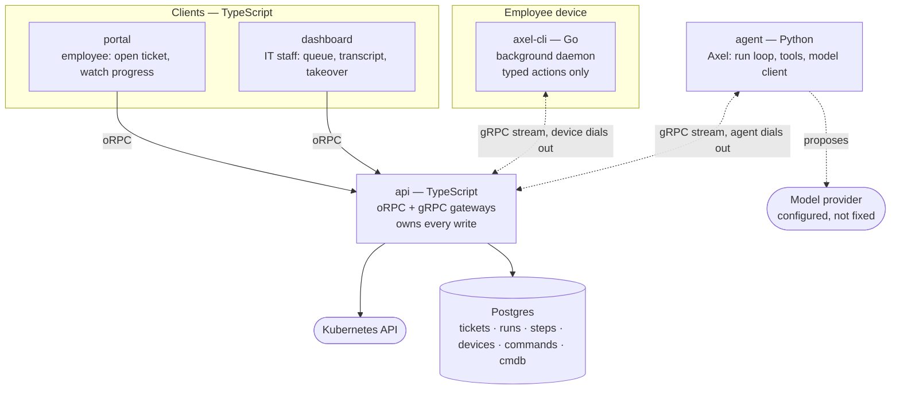

# Axiōma Architecture

**Document role:** System design — components, boundaries, and how they connect
**Related:** [idea.md](idea.md) for product intent, [implementation.md](implementation.md) for layout and build order

## Shape

Five independent projects, each with the toolchain its job actually calls for. They are not a monorepo and share no package manager; the workspace directory holds them side by side the way a set of checked-out repositories would. (A sixth directory, `web/`, holds the public marketing site on :3003 — part of the workspace and the Tiltfile, not of the platform loop; nothing in this document applies to it.)

| Project | Language | Job |
|---|---|---|
| `api` | TypeScript | oRPC surface for the frontends, gRPC gateways for both agents. The only component that writes. |
| `portal` | TypeScript | Employee web app. |
| `dashboard` | TypeScript | IT web app. |
| `agent` | Python | Axel — the reasoning loop, tool registry, and model client. |
| `cli` | Go | axel-cli — one static binary on an employee laptop. |

The language boundaries are not incidental. Python is where the agent ecosystem lives — model clients, observability, computer-use. Go produces a single binary with no runtime to install on a laptop, which is the constraint that dominates everything about that component. TypeScript holds the frontends and the API because the contract between them infers end to end there and nowhere else.

## Component Map

Both agents are gRPC **clients**. The API runs both servers. Neither can be dialled directly — one is a worker on whatever network it happens to run on, the other is behind NAT on a laptop that sleeps — so each dials out and holds a single bidirectional stream that work is pushed down.

## The Rule That Shapes Everything

**Axel has no database credentials, no cluster credentials, and no path to a device.**

Every side effect is a `ToolRequest` sent to the API, which executes it and returns the result. Axel decides; the API acts and persists.

Three things follow, and they are the reason for the arrangement:

- Persistence and authority live in one place, so there is no second ORM, no duplicated schema, and no question about which component wrote a row.
- A run is reproducible from its transcript, because tool name plus validated input is the whole record of what happened.
- Credentials never leave the API. Compromising the agent yields the ability to *ask* for things, not to do them.

## Contracts

Two, each where a boundary genuinely exists.

**oRPC, for the TypeScript half.** `api/src/contracts` declares procedures with zod schemas and imports nothing but `@orpc/contract` and `zod` — that constraint is what makes it safe to copy. `pnpm contracts:publish` mirrors it verbatim into `portal/src/sdk/contracts` and `dashboard/src/sdk/contracts`, stamped as generated and never edited in place. Handlers live in `api/src/server` and are bound with `implement(appContract)`, so a handler whose output stops matching the declared schema fails to typecheck in `api` rather than at runtime in a frontend that mirrored a contract the server no longer honours.

**Protocol buffers, for the language boundaries.** `api/proto/axioma.proto` is the source of truth, mirrored into `agent/` and `cli/` by the same command. It defines `AgentChannel` and `DeviceChannel` — same shape, remote side dials in.

Contract-first is what allows separate repositories at all. A contract that dragged in a Hono context and an auth module could not cross into a frontend that has neither.

## Axel

A bounded loop: read, think, act, verify. The loop owns the sequence and the limits; the model owns only what to try next. No verdict is taken from model confidence.

**Tools are typed and registered.** Axel picks a tool by name and supplies parameters validated against a pydantic schema before anything leaves the process. It does not compose commands, shell strings, or API calls. Adding a capability means adding a tool, which is a code change and a review.

| Tool | Effect | Verified by |
|---|---|---|
| `cluster.read_pods` | read | — |
| `cluster.read_deployment` | read | — |
| `cluster.patch_image` | write | `cluster.read_deployment` |
| `device.read_state` | read | — |
| `device.run_action` | write | `device.read_state` |
| `device.computer_use` | write | `device.read_state` |
| `cmdb.record_observation` | write | — |

Every write that changes external state names the read that confirms it. A write returning success means the call was accepted, not that the problem is fixed — so after acting, Axel re-reads through the named read tool. `cmdb.record_observation` is the deliberate exception: a CMDB observation has no external state to re-read — the write *is* the record, additive rather than corrective — so its `verified_by` is empty by design, not by omission.

**The loop is bounded.** Ceilings on tool calls, model turns, and wall time. Hitting any of them ends the run as `exhausted` and escalates, rather than leaving a ticket in a partial state. Without this a confused agent loops and the ticket neither resolves nor escalates.

**Unknown tools and invalid input are observations, not crashes.** They go back into the transcript so the model can correct itself inside the same budget.

**The model is not fixed.** No provider is named in the design. The adapter is configured with an endpoint, model, and credentials, and the run record stores which model actually answered rather than which one was configured.

## axel-cli

One Go binary, two modes.

**`axel-cli daemon`** is headless and runs as a logon Scheduled Task. There is no terminal attached, so there is no terminal UI. It holds the outbound connection, executes typed actions, and reports results.

**`axel-cli status | enroll | doctor`** are operator-facing, run by IT staff on a machine they are debugging. These carry the terminal UI — [Bubble Tea v2](https://charm.land/bubbletea) (`charm.land/bubbletea/v2`) with Lip Gloss — because that is where a person is actually looking.

Design points that matter:

- **Outbound only.** The device dials the gateway; the gateway never dials in. That is what works through NAT, on home networks, and behind corporate proxies without a firewall change.
- **Identity** is a UUID minted on first run and persisted under the user profile. It survives restarts, upgrades, and network roaming, and dies with the profile — the right lifetime for "this person's laptop". A hardware ID would outlive a reimage, clone with a VM image, and be a privacy artifact besides.
- **Liveness.** A sleeping laptop does not close its TCP connection, it stops answering. Only an application-level ping notices. The client pings on an interval and reconnects with exponential backoff plus jitter, so a fleet waking together does not stampede.
- **Replay.** On reconnect the device reports the last sequence it processed and the gateway replays past it. Deliberately a bounded in-memory outbox, not durable queuing.
- **A logon Scheduled Task, not a Windows service.** A service runs as LocalSystem in session 0, which cannot reach the user profile, mapped drives, or per-user applications — where most real laptop problems live. It also installs without administrator rights.

**Actions are named, never composed.** The gateway sends an action name and typed parameters; the argument list for each action is written out in the binary. Facet reads work the same way. No command string crosses the boundary, which is what stops a ticket talking the agent into running something arbitrary.

Computer-use is the second tier and is installed separately, as `cua-computer-server` on the device — `python -m computer_server`, an HTTP/WebSocket surface on a loopback port, with a `[driver]` extra for the native Cua Driver backend. [cua](https://github.com/trycua/cua) is the choice because its driver runs in the background — agents click, type, and verify *without stealing the cursor or focus* — which is the property that makes this acceptable on a laptop somebody is working on. Agent-S was rejected for using PyAutoGUI, which takes the real mouse and keyboard, and for requiring a separately hosted grounding model.

cua is Python and axel-cli is Go, so the language boundary is a process boundary: `cua-computer-server` runs locally and axel-cli drives it over its local API. Axel itself has no cua dependency, because Axel has no device path at all — it asks the API, the API dispatches to axel-cli, and axel-cli decides which tier can serve the request.

A device without cua installed **refuses** a computer-use request rather than falling back to something else. That is intended: a missing tier two means escalate, not improvise.

## Kubernetes

The first connector, and it lives in the API because the API owns every side effect.

**Reads** come from pod status rather than events wherever the signal exists there: status is structured, events are prose. `containerStatuses[].state.waiting.reason` gives `ImagePullBackOff` and `CrashLoopBackOff` directly, `lastState.terminated.reason` gives `OOMKilled`, and `conditions[PodScheduled].reason` gives `Unschedulable` with the scheduler's own message. Events are read only where the signal exists nowhere else, which in practice means volume mount failures.

**Writes** use JSON Patch with an explicit path, not strategic merge. A JSON Patch with `op: replace` fails loudly if the object is not the shape the caller believed; strategic merge applies silently and the mistake surfaces later. Every write runs once with `dryRun` before running for real.

**Rollout status** is polled, not watched — fewer moving parts, and the caller gets a progress stream for free.

## Data Model

Six tables carry the MVP, alongside Better Auth's four.

| Table | Holds |
|---|---|
| `tickets` | Reporter, title, body, status, route, resolution, timestamps |
| `agent_runs` | One row per run: model used, status, outcome, token counts, timing |
| `agent_steps` | The transcript: ordered steps with tool name, input, output, and reasoning |
| `devices` | Device ID, hostname, user, platform, last seen, connection state |
| `device_commands` | Sequence, action, parameters, status, result |
| `cmdb_items` | Observed entities and relationships, each with its source |

`agent_steps` is what makes the dashboard useful and a bad run debuggable. Rows are written as the run proceeds, not at the end, so a run that hangs still shows how far it got.

## CMDB

Two jobs, worth separating.

**As context, it is read.** Before diagnosing, Axel asks what the platform already believes about the service, the device, and their dependencies.

**As a record, it is written.** Everything observed goes back — additive observations, never overwrites.

Every row records **where the fact came from**: which ticket, which run, which step, and when. That provenance is a few columns and it is the only part of a governed CMDB that is genuinely expensive to add later. Proposal workflows, separate ownership, approval before correction, and rollback can all be built on top of it whenever they are wanted.

## Stack

| Layer | Choice |
|---|---|
| Frontends | TanStack Router + React 19, Tailwind 4, Vite |
| API | Hono, oRPC, Better Auth |
| Database | PostgreSQL via Docker Compose, Drizzle |
| Agent | Python 3.14, uv, pydantic, model-agnostic LLM client |
| Device agent | Go 1.25, one static binary; Bubble Tea v2 for operator commands |
| Wire | gRPC for both agent boundaries |
| Lint and format | Biome (TypeScript), ruff (Python), gofmt (Go) |

The frontends are SPAs rather than a server-rendered framework. The API is a separate service, so there is no benefit in a framework that wants to colocate route handlers with pages.

## What This Architecture Does Not Do

Stated because the gaps are deliberate and someone reading the component map will look for them.

- **Human access is capability-gated.** oRPC procedures deny by default and resolve direct and team role capabilities once per request; reporter-owned ticket views retain their narrower response shapes as defence in depth.
- **Nothing constrains blast radius.** A cluster write can patch any deployment the service account reaches; a device action runs with the logged-in user's rights.
- **No action is approved before it runs.** Axel acts on its own judgment.
- **Nothing is idempotent.** Retrying a dispatched action can apply it twice.
- **Command dispatch is not durable.** If the API restarts, in-flight device commands are lost.
- **The device connection is not authenticated.** The stream is plaintext and the device ID in the hello is client-asserted — any process that can reach the gateway can impersonate any device — and the binary is unsigned.

The remaining gaps are out of scope by decision rather than oversight. Authorization was addressed first because later approvals and restricted records are meaningless without an enforceable human identity; idempotency remains the next priority because "did that action already run" becomes unanswerable after the first timeout.
